# guntersweiler.net Email-Umzug

In diesem Artikel wird beschrieben, wie die Email-Umzug für @guntersweiler.net durchgeführt wird.

## Inhaltsverzeichnis

[[toc]]

## Eckdaten

Alle Mailboxen werden von [mail.gunti.cloud][gunticloud] auf Mailboxen bei [Servercow.de][servercow] umgezogen.

Im Verlauf der Migration werden neue Passwörter vergeben. Diese erhaltet ihr persönlich als Nachricht.

Alle Emails werden kopiert und während der ersten paar Tage regelmässig nachsynchronisiert, um einen Verlust zu verhindern. Die alte Mailbox bleibt vorübergehend bestehen, damit ihr auf allenfalls fehlende Emails, Kontakte oder Kalendereinträge zugreifen könnt.

::: warning ACHTUNG!
Die Umschaltung auf die neuen Mailboxen erfolgt am **Sonntag, 17. März 2024 zwischen 12:00 und 14:00**. In dieser Zeit solltet ihr vermeiden, Emails zu versenden, Kalendereinträge zu erstellen oder Kontakte zu ändern.
:::

Nachdem der Umzug abgeschlossen ist, solltet ihr eure Geräte überprüfen und die bestehenden Email-Accounts entfernen, bevor ihr sie neu anlegt. Für Email-Clients wie Mozilla Thunderbird ist eventuell nur eine Änderung einiger Einstellungen erforderlich (_siehe unten_). Ebenfalls solltet ihr eure Adressbücher und Kalender über das [alte Webmail][gunticloud-webmail] exportieren und über das [neue Webmail][servercow-webmail] importieren. Mehr dazu [weiter unten](#adressbuch-kalender-umziehen).

## Links

Die folgenden Links solltest ihr euch als Lesezeichen abspeichern.

- [Webmail][servercow-webmail]: Zugriff auf eure Emails aus dem Webbrowser
- [Mailcow Portal][servercow-portal]: Kontoverwaltung (z.B. Passwort ändern) (_melde dich als "Mailbox-Benutzer" an_)

## Allgemeine Zugangsdaten

::: warning Neues Passwort!
Du erhältst ein neues Passwort. Ändere dies bitte [hier über das Mailcow Portal][servercow-portal], bevor zu dich mit deinen Geräten anmeldest.
:::

Mit den folgenden Zugangsdaten kannst du die gängisten Mail-Clients einrichten.

|               | alt                      | new                      |
| ------------- | :----------------------  | ------------------------ |
| IMAP Server   | ~~mail.gunti.cloud~~     | hosted.mailcow.de        |
| IMAP Port     | 993                      | 993                      |
| SMTP Server   | ~~mail.gunti.cloud~~     | hosted.mailcow.de        |
| SMTP Port     | 465                      | 465                      |
| Benutzername  | _name_@guntersweiler.net | _name_@guntersweiler.net |

## Einrichten Endgeräte

### iPhone / iPad

Bevor du dein Email-Konto von deinem iPhone entfernst, prüfe erst ob das Konto über ein Profil hinzugefügt wurde.

#### Profil entfernen

1. Öffne die iPhone-Einstellungen und navigiere zu "Allgemein" > "VPN und Geräteverwaltung".
2. Falls du einen Eintrag mit deiner Email-Adresse siehst, wurden dein Email-Konto über ein Profil hinzugefügt. Falls nicht, folge dem nächsten Abschnitt "Konto manuell entfernen".
3. Wähle das Profil mit deiner Email-Adresse und tippe auf "Profil entfernen". 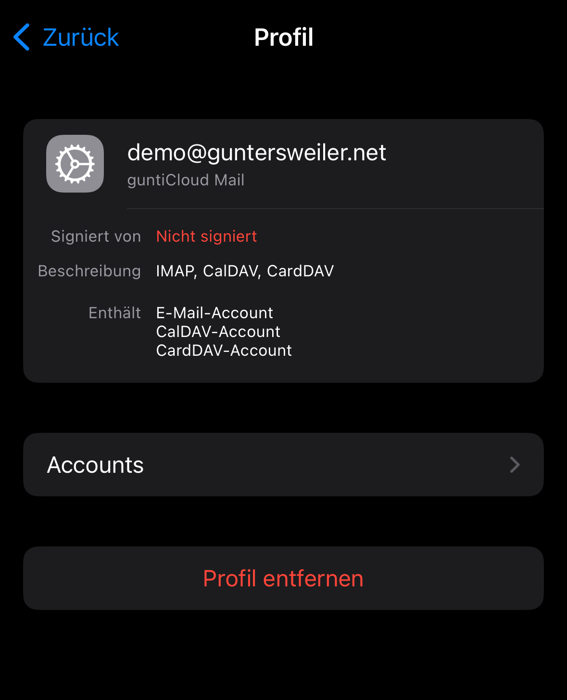
   Bestätige anschliessend mit deinem PIN-Code und einem erneuten Tipp auf "Entfernen".

Wenn du das Profil entfernt hast, kannst du den Abschnitt "Konto manuell entfernen" überspringen.

#### Konto manuell entfernen

1. Öffne die iPhone-Einstellungen und navigiere zu "Mail" > "Accounts".
2. Tippe auf jeden Eintrag mit deiner Email-Adresse (oder einer passenden Beschreibung) und tippe anschliessend auf "Account löschen".
3. Bestätige anschliessend mit "Vom iPhone löschen".

#### Konto hinzufügen

1. Öffne die iPhone-Einstellungen und navigiere zu "Mail" > "Accounts".
2. Wähle anschliessend "Account hinzufügen".
3. Wähle "Microsoft Exchange". 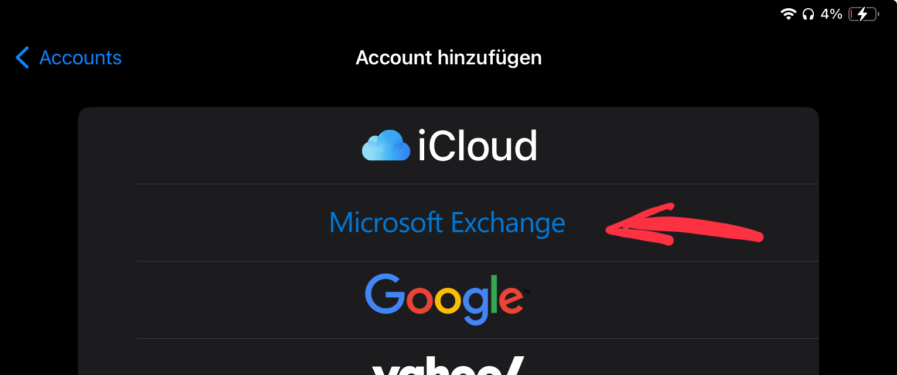
4. Gib anschliessend deine Email-Adresse und einen Namen für dein Postfach ein. Tippe anschliessend auf "Weiter". 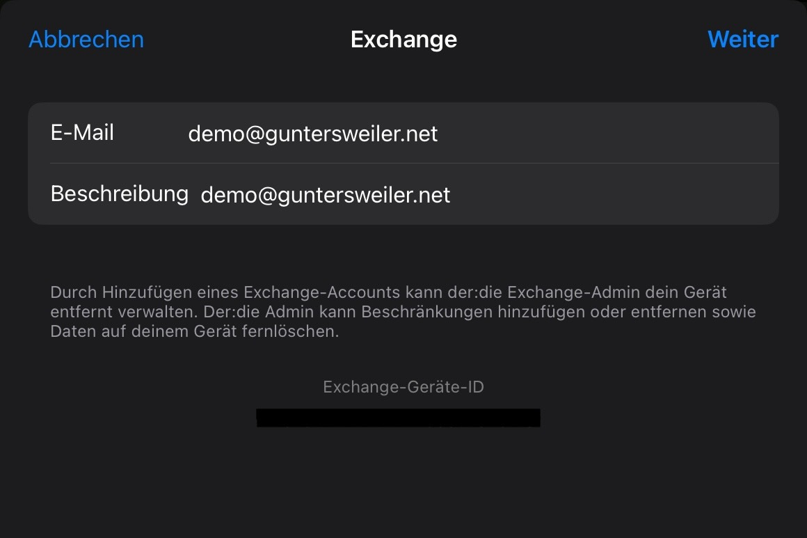
5. In der nachfolgenden Frage wähle "Manuell konfigurieren". 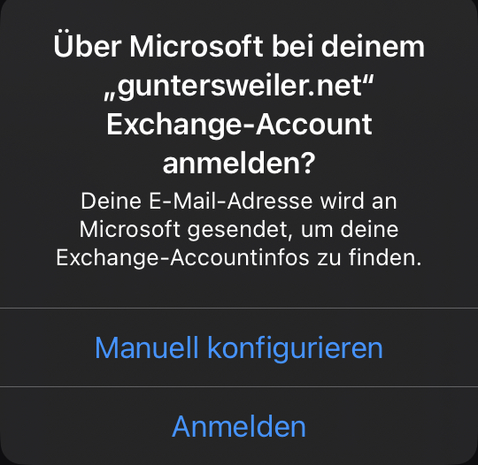
6. Gib im nachfolgenden Bildschirm dein neues Passwort ein. Tippe auf "Weiter".
7. Füge folgende Informationen hinzu und tippe anschliessend auf "Weiter":
    - Server: `hosted.mailcow.de`
    - Benutzername: _deine Email-Adresse_
   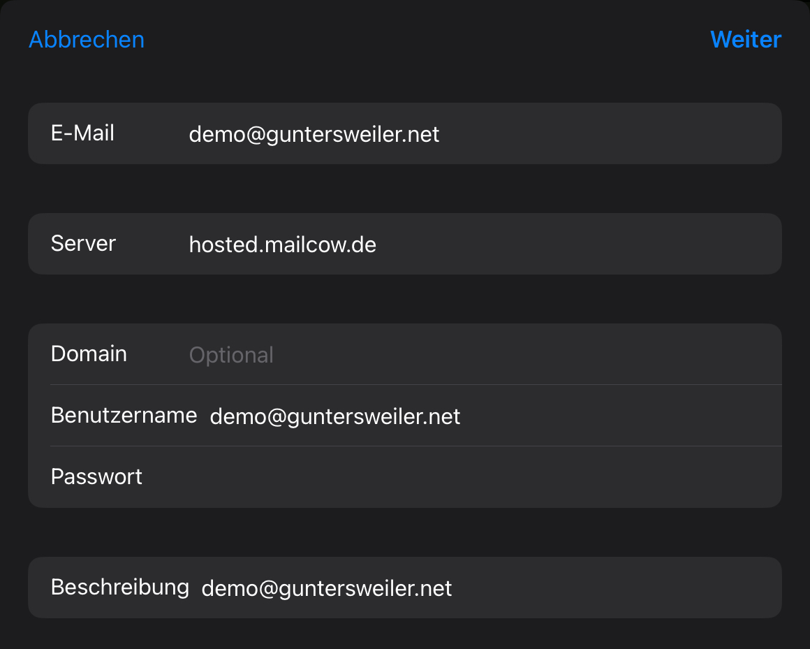
8. Wähle aus, welche Daten du synchroniseren möchtest und wähle anschliessend "Sichern".

### Mozilla Thunderbird

Du kannst entweder das bestehene Email-Konto aus Thunderbird löschen und neu anlegen, oder die Einstellungen des bestehenden Kontos anpassen. Bedenke jedoch, dass du beim Löschen des Mailkontos eventuell andere Einstellungen ebenfalls verlierst. Emails gehen dadurch jedoch nicht verloren.

#### Konto neu anlegen (empfohlen)

1. Entferne als erstes dein bestehendes Email-Konto aus Thunderbird. Klicke dazu auf das Menü > "Konten-Einstellungen" 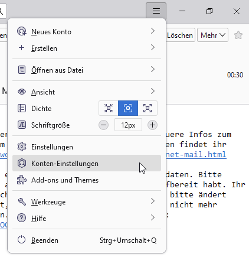
2. Wähle dein Email-Konto in der Liste links aus. Klicke anschliessend auf "Konten-Aktionen" > "Konto entfernen". 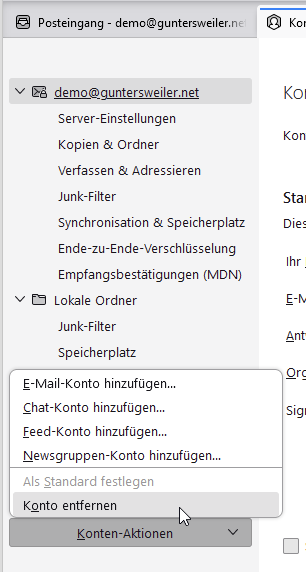
3. Bestätige im nachfolgenden Dialog mit "Entfernen".
4. Klicke anschliessend erneut auf "Konten-Aktionen" und wähle "E-Mail-Konto hinzufügen...". 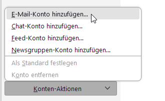
5. Gib deinen Namen, deine Email-Adresse und dein neues Passwort ein. Stelle sicher, dass "Passwort speichern" aktiviert ist. Klicke anschliessend auf "Weiter".
6. Wenn Thunderbird die Einstellungen automatisch erkennt, prüfe ob der Posteingangs- und Postausgangs-Server als `hosted.mailcow.de` erkannt wurden. Wenn nicht, muss die Konfiguration manuell durchgeführt werden. Klicke dazu unten auf "Manuell einrichten". Sollten die Einstellungen korrekt erkannt worden sein, klicke auf "Fertig". Du kannst die folgenden Schritte überspringen. 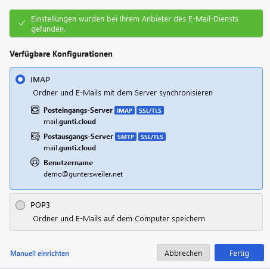
7. Solltest du die Einstellungen manuell erfassen müssen, benutze die oben unter "Allgemeine Zugangsdaten" genannten Infos. 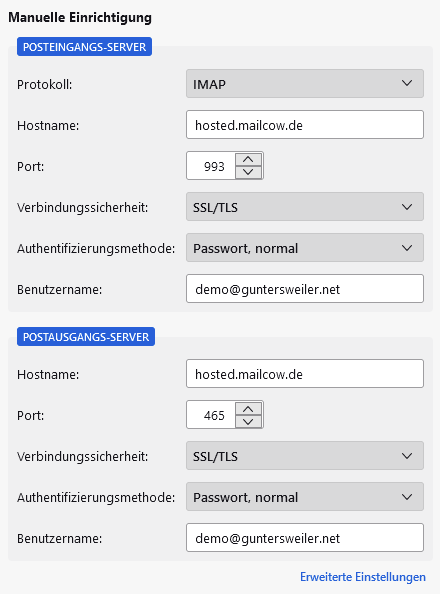
8. Klicke anschliessend auf "Erneut testen". Sollte Thunderbird die Einstellungen akzeptieren, klicke auf "Fertig".

Du kannst ausserdem dein Adressbuch einfach in Thunderbird einbinden.

9. Wähle dazu in der Navigationsleiste links "Adressbuch".
10. Klicke anschliessend neben "Neues Adressbuch" auf das Menü und wähle "CardDAV-Adressbuch hinzufügen". 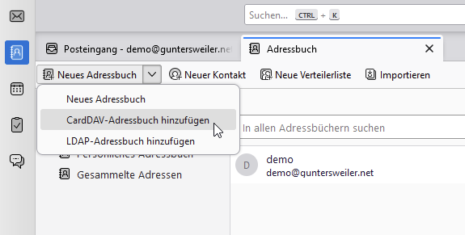
11. Füge unter "Benutzername" deine Email-Adresse ein.
12. Füge unter "Adresse" folgende URL ein: `https://hosted.mailcow.de/SOGo/dav/<name>@guntersweiler.net/Contacts/personal/`.
    Ersetze dabei `<name>@guntersweiler.net` mit deiner eigenen Email-Adresse. Klicke anschliessend auf "Weiter".
13. Gib in der nachfolgenden Abfrage dein Passwort ein und stelle sicher, dass du die Option zum Passwort-Speichern aktiviert hast.
14. Nachfolgend werden alle deine Adressbücher angezeigt. Klicke auf "Weiter".
15. Deine Kontakte sollten nun angezeigt werden. 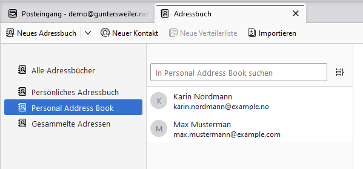

Du kannst ausserdem deinen Kalender in Thunderbird einbinden.

16. Wähle dazu in der Navigationsleiste links "Kalender".
17. Klicke unten links auf "Neuer Kalender...".
18. Im folgenden Fenster wählst du "Im Netzwerk" und dann "Nächste".
19. Als Benutzername fügst du deine Email-Adresse ein.
20. Unter "Adresse" fügst du folgende URL ein: `https://hosted.mailcow.de/SOGo/dav/<name>@guntersweiler.net/Calendar/personal/`. Ersetze dabei `<name>@guntersweiler.net` mit deiner eigenen Email-Adresse. Klicke anschliessend auf "Kalender suchen".
21. Gib in der nachfolgenden Abfrage dein Passwort ein und stelle sicher, dass du die Option zum Passwort-Speichern aktiviert hast.
22. Du solltest nun alle Kalender aufgelistet kriegen. Klicke auf "Abonnieren".
23. Deine Kalendereinträge sollten nun angezeigt werden. 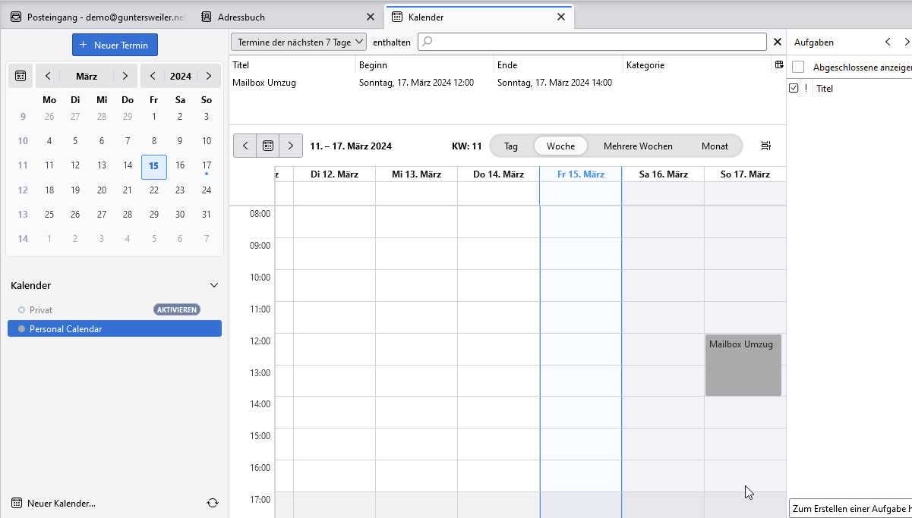

#### Bestehendes Konto ändern

1. Klicke in Thunderbird auf das Menü > "Konten-Einstellungen" 
2. Wähle unter deinem Email-Konto den Punkt "Server-Einstellungen" 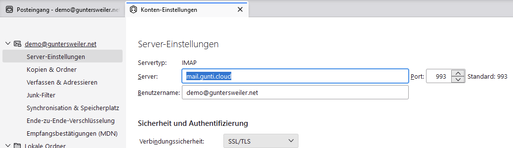
3. Ändere im Feld "Server" die Adresse auf `hosted.mailcow.de`. Drücke anschliessend `ENTER`.
4. Du wirst gebeten, Thunderbird neu zu starten. Klicke auf "Neu starten". 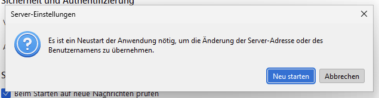
5. Nach dem Neustart wirst du gebeten, das Passwort für deine neue Mailbox einzugeben. Gib hier das neue Passwort ein und stelle sicher, dass du den Punkt "Die Passwortverwaltung benutzen, um dieses Passwort zu speichern" aktiviert hast. 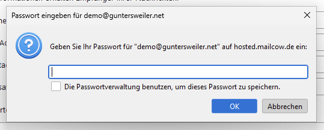
6. Gehe anschliessend zurück in die "Konten-Einstellungen" und wähle dein Konto aus. Der Eintrag enthält üblicherweise deine Email-Adresse. Klicke anschliessend unter "Postausgangs-Server (SMTP)" auf "Postausgangs-Server (SMTP) bearbeiten ..." 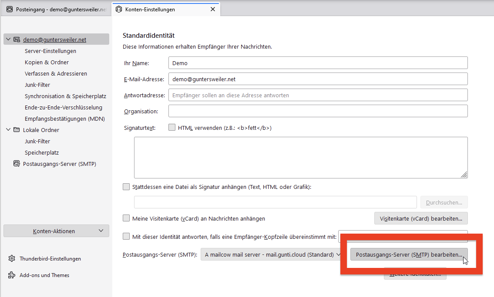
7. Im darauf folgenden Dialog, ändere den Eintrag unter "Server" auf `hosted.mailcow.de`. Bestätige anschliessend mit "OK".
8. Das neue Passwort muss auch für den Mailversand eingesetzt werden. Erstelle dafür eine neue Email-Nachricht. Du kannst sie an dich selbst senden, wichtig ist nur, dass du auf "Senden" klickst. Dabei solltest du wieder nach deinem Passwort gefragt werden. Vergewissere dich auch hier, dass du dein Passwort speicherst, da du ansonsten bei jedem Email-Versand gefragt wirst.
9. Prüfe anschliessend deinen Posteingang nach einer Email von dir selbst. Wenn du sie erhalten hast, hat der Versand erfolgreich geklappt.

## Adressbuch & Kalender umziehen

Leider können Adressbücher nicht automatisch umgezogen werden. Daher hier eine Anleitung wie ihr Beides händisch umziehen könnt. Am Besten macht ihr dies an einem PC oder Laptop.

### Adressbuch

Du kannst dein ganzes Adressbuch über die Webmail-Oberfläche exportieren und importieren.

1. Melde dich dafür auf dem [alten Webmail][gunticloud-webmail] mit deinen alten Anmeldedaten an.
2. Wähle anschliessend oben in der Navigationsleiste "Addressbuch". 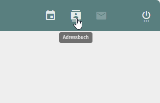
3. Klicke bei deinem persönlichen Adressbuch auf das Drei-Punkte-Menü und wähle "Export". 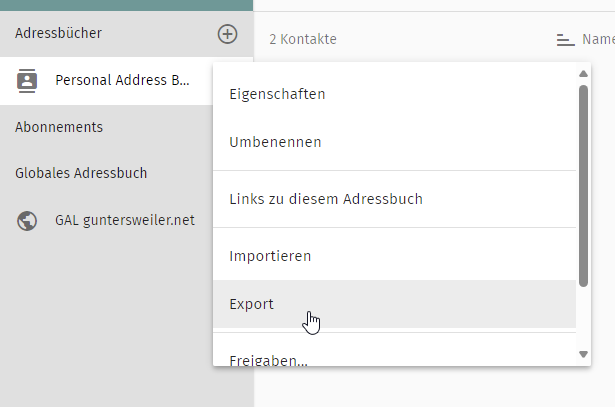
4. Du erhältst eine Datei zum Download. Diese wird später für den Import benötigt. 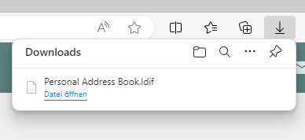
5. Melde dich anschliessend auf dem [neuen Webmail][servercow-webmail] mit deinen neuen Anmeldedaten an.
6. Wähle anschliessend oben in der Navigationsleiste wieder "Addressbuch". 
7. Klicke bei deinem persönlichen Adressbuch auf das Drei-Punkte-Menü und wähle "Importieren". 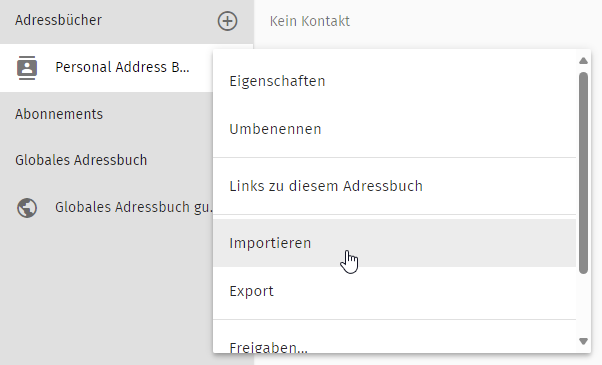
8. Klicke auf "Hochladen" und wähle die Datei aus, die du zuvor heruntergeladen hast.
9. Wenn alles funktioniert hat, solltest du all deine Kontakte wieder vorfinden. 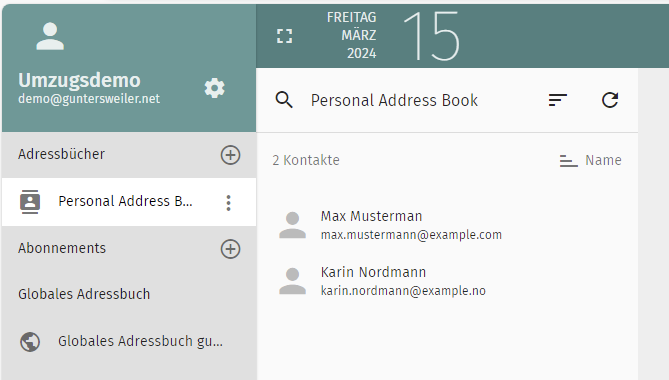

Solltest du mehrere Adressbücher haben, kannst du diesen Vorgang für jedes Adressbuch wiederholen.

### Kalender

Du kannst deine Kalendereinträge genauso wie deine Adressbucheinträge exportieren.

1. Melde dich dafür auf dem [alten Webmail][gunticloud-webmail] mit deinen alten Anmeldedaten an.
2. Wähle anschliessend oben in der Navigationsleiste "Kalender". 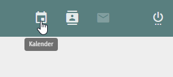
3. Klicke bei deinem persönlichen Kalender auf das Drei-Punkte-Menü und wähle "Exportieren". 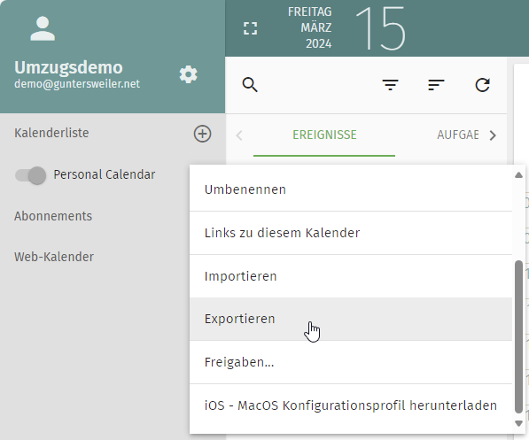
4. Du erhältst eine Datei zum Download. Diese wird später für den Import benötigt. 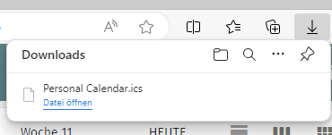
5. Melde dich anschliessend auf dem [neuen Webmail][servercow-webmail] mit deinen neuen Anmeldedaten an.
6. Wähle anschliessend oben in der Navigationsleiste wieder "Kalender". 
7. Klicke bei deinem persönlichen Kalender auf das Drei-Punkte-Menü und wähle "Importieren". 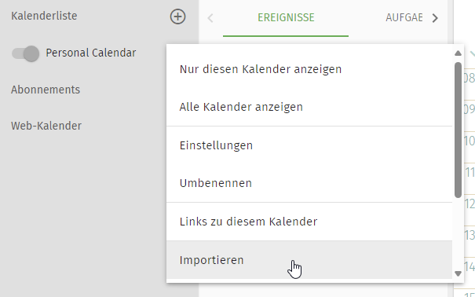
8. Klicke auf "Hochladen" und wähle die Datei aus, die du zuvor heruntergeladen hast.
9. Wenn alles funktioniert hat, solltest du all deine Kalendereinträge wieder vorfinden. 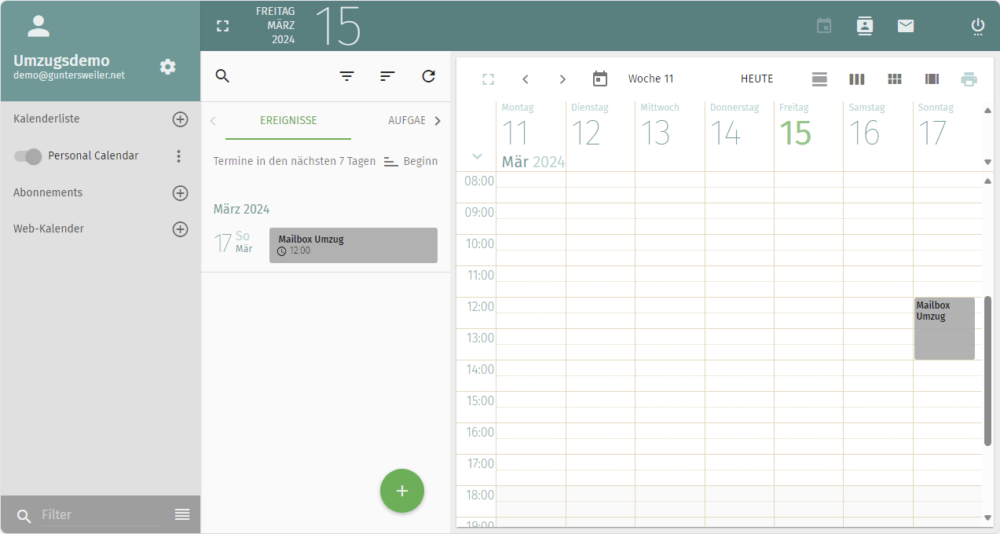

Solltest du mehrere Kalender haben, kannst du diesen Vorgang für jedes Adressbuch wiederholen.

[gunticloud]: https://mail.gunti.cloud
[gunticloud-webmail]: https://mail.gunti.cloud/SOGo/
[servercow]: https://servercow.de
[servercow-webmail]: https://hosted.mailcow.de/SOGo/
[servercow-portal]: https://hosted.mailcow.de/
